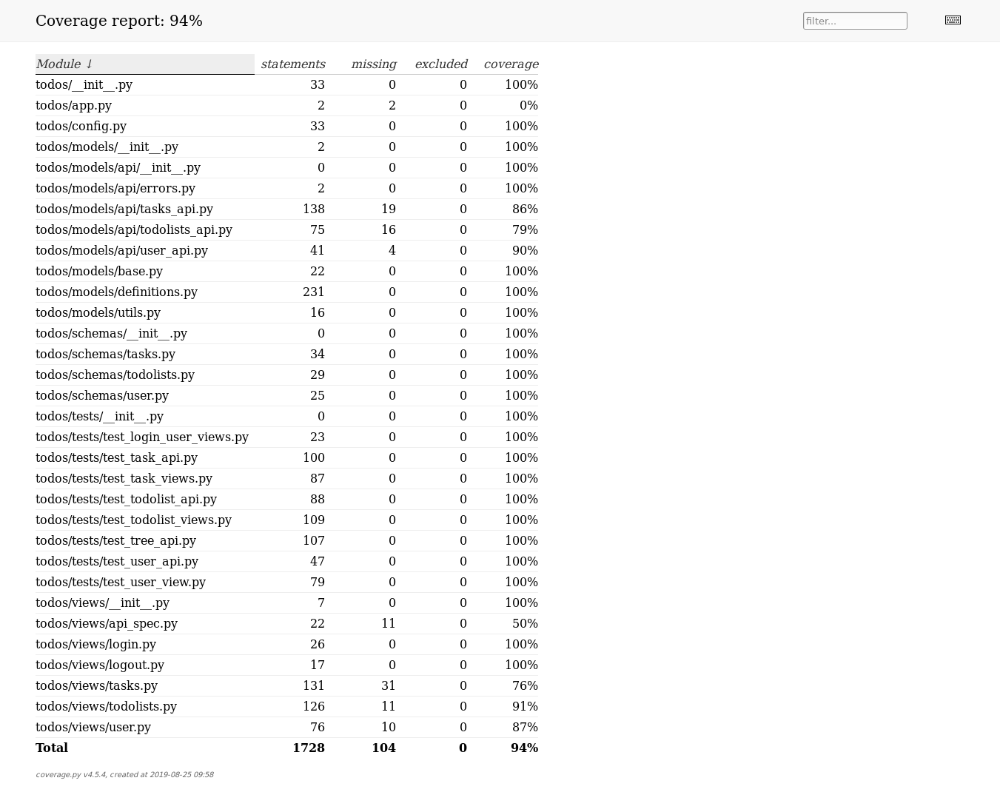

# todos
Todos flask app with swagger

The repository includes flask app with authorization which
allowes to create todolists with tasks inside.

## Virtual environment

To start using this app create and activate virtual 
environment and install required packages

```sh
$ pyenv local 3.7.2
$ python -mvenv env
$ source env/bin/activate

$ pip install -e ".[dev]"
```

## Run application and use swagger api :)

You will need running mysql server with created db and 
credentials as in config.ini file

Next you will have to run migration:
```sh
$ manage db upgrade
```

To run app launch the following:

```sh
$ FLASK_ENV=development FLASK_APP=todos/app.py flask run
```

Now you can access swagger api in brower:
http://127.0.0.1:5000/api/

# Endpoints

The following endpoints are available:
* user for managing users
* login to log into app
* logout
* todolist to manage todolists
* task to manage tasks inside todolists

Below you can see compressed endpoints view:


and expanded endpoints view:


Databases schema:
[db schema](todos/models/doc/todos.pdf)

# Test coverage

Below you can find test coverage report for the project:
